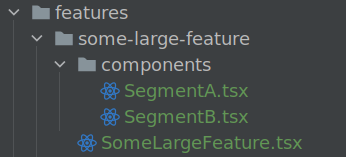

<!--suppress HtmlDeprecatedAttribute -->
<div align="center">

## TSX-monorepo

This project is an opinionated collection of tools, apps, and libraries intended for supporting React development.

</div>

----

**Table of contents**

- [Goals](#goals)
- [Setup](#setup)
- [Projects](#projects)
- [Docs](#docs)
- [Contributing](#contributing)

## Goals

- Consistent code formatting in every package.  [ESLint](https://eslint.org/docs/user-guide/getting-started) is used for identifying and reporting on patterns found
  in ECMAScript/JavaScript code, with the goal of making code more consistent and avoiding bugs.
- First class [TypeScript](https://www.typescriptlang.org/) support.
- Hot reloading adjacent packages in the repo.
- First class documentation support via [Bit](https://harmony-docs.bit.dev/essentials/what-is-bit).
- Consistent styling by use of `styled-components` and `styled-system`.
- Optional publishing support.
- [Tree shaking](https://webpack.js.org/guides/tree-shaking/) for every React library.
  - This is accomplished using webpack's side effects. If you're unfamiliar with side effects, [read more here](https://sgom.es/posts/2020-06-15-everything-you-never-wanted-to-know-about-side-effects/) for a good explanation.
- Working "go to definition" feature in IDEs for every package.
- Icons by [react-icons](https://react-icons.github.io/react-icons/).
- Unit Testing support via Jest and [React Testing Library](https://testing-library.com/docs/react-testing-library/intro/).
- E2E testing with [Playwright](https://playwright.dev) + Jest.

## Setup

- Ensure that you have [Node](https://nodejs.org/en/) and [Yarn](https://yarnpkg.com/) installed.
    - I run Node v14+ and haven't tried any lesser versions. Your mileage may vary if you're not on v14+.

### Linter

- `yarn lint`
- To modify rules, edit `packages/libs/eslint-config/index.js`

## Projects

- Standalone Front End applications are located within `packages/apps`.
- Shared libraries and utilities are located within `packages/libs`.
- Data fetching APIs and libraries are located within `packages/data`.
    - Note: it's perfectly fine for isolated apps to include their own data fetching apis within their respective package folders.
- The NextJS application at `packages/docs` is responsible for rendering MDX components.  Shared components that contain a corresponding mdx file are aggregated by this package. For more information, check out `packages/docs`.

### NextJS Development

- run `yarn install`
- run `yarn next-dev`. Executes `yarn run dev --parallel --stream` which does the following:
  - starts `@rb/nextjs-template` in dev mode using `next dev`
  - runs `@rb/react-primitives` and `@rb/react-components` in watch mode (using `tsc`) which triggers a recompile on change (hot reloading).


## Shared Theme (see `packages/libs/react-primitives`)

- By designing components around a shared theme, colors and styles* can be swapped with ease without fear of breaking the codebase. The `styled-components` and `styled-system` packages utilize this theme and makes common variables like color, spacing, breakpoints available as props for every component. Every React component in this library is designed around this theme.
- Recommendations:
  - The ThemeProvider in the `react-primitives` package accepts two props:
    - `colors`, an object that maps to the ThemeColors interface in `react-primitives/src/theme/colors`
    - `box shadows`

## Conventions

- Every package must contain at least the following:
    - a `package.json` file.
    - either a `src` folder with code specific to the package's library or framework or an `index.js/index.ts` that exports the code or configuration of the package (
      JS/TS packages only).
    - a `tsconfig.json` (TypeScript projects only).
- Within a TypeScript React app, it's recommended that path aliasing be setup such that directories from the local package starts with `~`.
    - The base ESLint configuration is set up to split import groups based on external, internal, and sibling/parent/child. A 4th grouping is configured for
      apps-specific internal files. This is done for organizational purposes, as it's much easier to determine the origin of the imported code.
    - Example for a package with `src/components` and `src/pages` folder:

```typescript jsx
  // src/components/simple-div/SimpleDiv.tsx
import React from "react"

export default function SimpleDiv(): JSX.Element {
  return <div />
}
  ```

  ```typescript jsx
  // src/pages/about.tsx
import React from "react"

import SimpleDiv from "~components/simple-div/SimpleDiv.tsx"

import {localUtilityFunc} from "./utils"

export default function AboutPage(): JSX.Element {
  return <SimpleDiv onClick={localUtilityFunc} />
}
  ```

### React Best Practices:

#### Separate your styles from your api logic. This makes testing significantly easier and keeps your component files small and self-contained.

- A `Data` component does data fetching and then renders its corresponding `View` component. That’s it.

##### Problem:

```typescript jsx
// src/components/example/Example.tsx
import React from "react"

import useDataExample from "./utils"

export default function Example(): JSX.Element {
  // Problem: we've now coupled this component to some arbitrary 
  // API logic. This component may not render properly if the api 
  // isn't available during testing (common during CI).
  const {data} = useSomeApiData()
  return (
    <div>
      {/* apply styles, etc... */}
      {data}
    </div>
  )
}
```

#### Solution: split the component using the Data/View pattern.

```typescript jsx
// src/components/example/ExampleView.tsx
import React from "react"

export interface ViewProps {
  // never use `any` like this.  It's just an example ;)
  data: any
}

export default function ExampleView({data}: ViewProps): JSX.Element {
  return (
    <div>
      {/* apply styles, etc... */}
      {data}
    </div>
  )
}
```

```typescript jsx
// src/components/example/ExampleData.tsx
import React from "react"

import ExampleView from "./ExampleView"
import useDataExample from "./utils"

export default function ExampleData(): JSX.Element {
  const {data} = useSomeApiData()
  return <TableView data={data} />
}
```

Now we're more flexible.  We've eliminated the API coupling by keeping the styles contained within a separate component.  However, this presents with a tradeoff.

Pros:
- More flexible and likely more accurate tests.
- Can reuse the `ExampleData` container to supply the same logic to another component.

Cons: 
- Additional file to maintain (potentially offset by SoC).
- We now have to mock the API logic in order for the tests to pass.

Read more on the [Data/View pattern here](https://www.freecodecamp.org/news/react-superpowers-container-pattern-20d664bdae65/).

##### Feature Driven Development (FDD).

- This is a lightweight Agile technique, manifest in a project structure where your code is organized by what it accomplishes (i.e. features), rather than lumping all
  modules of like types into separate blobs of components, routes, logic, actions, etc.
- There is a direct correlation between the problem space (the requirements) and the implementation (the code)

##### FDD Folder Structure

- Reusable components that are specific to an application but not a feature should reside in `src/components`.
- Reusable components without a specific application should be placed in the `react-components` package.

- For a given featured name `<feature-name>`, place all related code in `src/features/<feature-name>`.
    - For large features, split the feature folder into multiple subfolders.
      

#### packages/libs/react-*

- Should not include code specific to project.
- They should not rely on project specific code, constants, router, etc.

## References

See the following blog posts. This guy is pretty good. I used his monorepo as a base for this repository:

- [How to set up a TypeScript monorepo and make Go to definition work](https://medium.com/@NiGhTTraX/how-to-set-up-a-typescript-monorepo-with-lerna-c6acda7d4559)
- [Making TypeScript monorepos play nice with other tools](https://medium.com/@NiGhTTraX/making-typescript-monorepos-play-nice-with-other-tools-a8d197fdc680)

